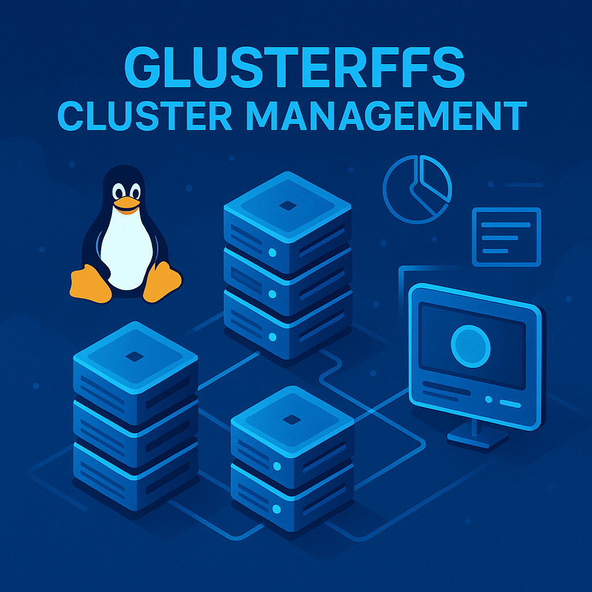

# _**Cluster de Almacenamiento Distribuido**_
[](https://deepwiki.com/VOIDX66/cluster_almacenamiento)
--




Herramienta interactiva escrita en Rust para gestionar clústeres de almacenamiento usando **GlusterFS**. Permite crear volúmenes, agregar o eliminar bricks, conectar peers y más, todo desde una interfaz de línea de comandos amigable.

> 🔧 **Estado actual**: prototipo funcional. Puedes clonarlo, compilarlo y usarlo libremente bajo los términos de la licencia MIT.
---

## 🚀 Instalación

### 1. Clonar el repositorio

```bash
git clone https://github.com/VOIDX66/cluster_almacenamiento.git
cd cluster_almacenamiento
```

### 2. Requisitos
* Una distribución Linux con acceso a sudo
* Rust y Cargo instalados (https://rustup.rs) (opcional, solo para realizar cambios y compilarlos)
* GlusterFS (cliente y servidor) instalados

### 3. Instalar GlusterFS
> Asegúrate de tener **tanto el servidor como el cliente de GlusterFS** instalados (`glusterfs-server` y `glusterfs-cli` o `glusterfs-client`), dependiendo de tu distribución.
---
Debian/Ubuntu
```bash
sudo apt update
sudo apt install -y glusterfs-server glusterfs-client
```
Arch Linux
```bash
sudo pacman -S glusterfs
```
Fedora
```bash
sudo dnf install -y glusterfs-server glusterfs-cli
```
### 4. Iniciar el servicio GlusterFS
```bash
sudo systemctl enable --now glusterd
```
### 5. Compilar el programa (opcional, solo para realizar cambios y compilarlos)
```bash
cargo build --release
```
El binario resultante estará en:
```bash
/target/release/cluster_almacenamiento
```
Si no cuenta con Rust y Cargo, en la ruta anterior ya se encuentra el binario compilado

### 🧪 Uso
Ejecuta el programa:
```bash
sudo ./target/release/cluster_almacenamiento
```
Desde allí podrás:
* Crear y administrar volúmenes GlusterFS
* Agregar y eliminar bricks
* Conectar y listar peers
* Ver información detallada del clúster
* Gestionar el ciclo de vida de los volúmenes (start, stop, delete)

### ❗ Recomendaciones
* Ejecuta el programa desde una terminal interactiva (TTY)
* Todos los nodos del clúster deben tener GlusterFS instalado y estar accesibles entre ellos vía red
* Verifica que los peers estén correctamente conectados antes de crear o modificar volúmenes


Este proyecto está licenciado bajo la Licencia MIT. Ver el archivo [LICENSE](./LICENSE) para más detalles.
